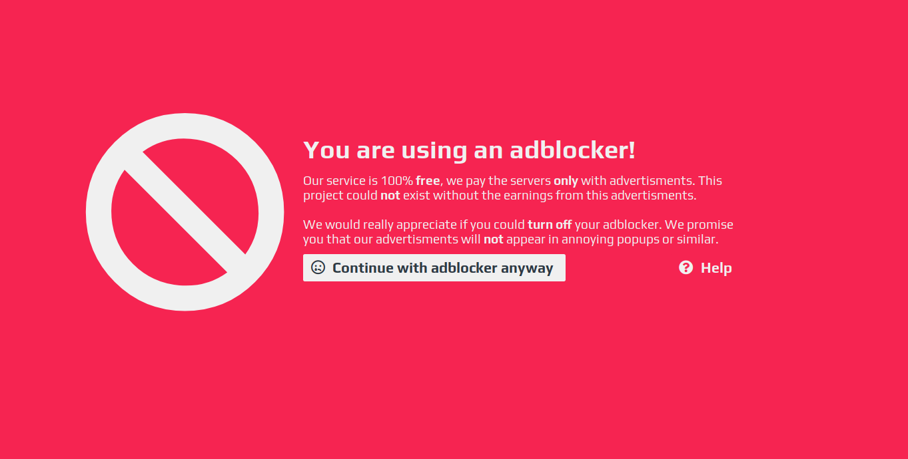

# Adblocker

## Possible solutions:

 If you don't see ads, something on your computer or in your network is blocking them. Make sure that:

 - You don't have any browser add-ons installed that could block ads or modify the content of websites 

- You don't have any ad blocking software installed on your computer \(e.g. AdGuard or antivirus software that also blocks ads\) 

- There is no network filter installed in your home network

It's hard for us to know what exactly is blocking the ads on your computer or your network, but if you get the Adblock message then something is blocking the ads. [https://support.aternos.org/hc/en-us/articles/360034748092](https://support.aternos.org/hc/en-us/articles/360034748092)


If this does not help, contact support@aternos.org or make a thread on [https://board.aternos.org/](https://board.aternos.org/) and provide the ID you get on the adblocker warning as well as whether you can see ads when continuing.


